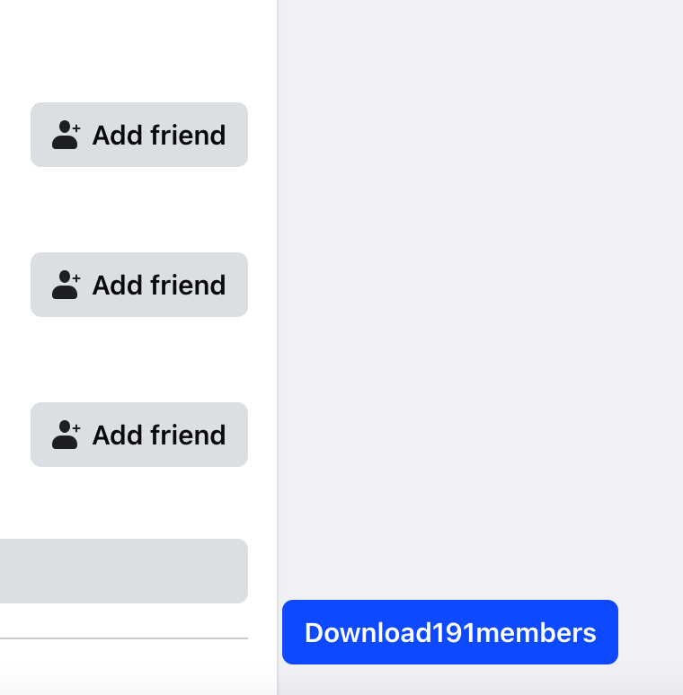
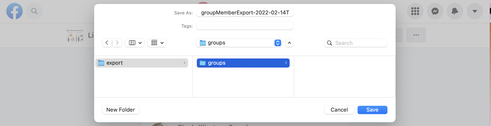

# Facebook Group Members Scraper

Script to scrape Facebook group members and export them into a CSV file. This Facebook Group members extractor works on Chrome browser.

## How to run the Facebook Group Extractor script

### Exported Fields

- **Profile Id**: Unique Facebook identifier. Multi-digit number.
- **Full Name**: First name and last name concatenated.
- **Profile Link**: Profile URI in the format `https://www.facebook.com/{{username}}`. When not available, defaults to `https://www.facebook.com/profile.php?id={{profile_id}}`.
- **Bio**: Profile bio text.
- **Image Src**: Profile picture URI.
- **Group Id**: Facebook group identifier. Multi-digit number.
- **Group Joining Text**: Relative time since the user joined the group. In the format: "Member since XX".
- **Profile Type**: Facebook profile type. "User" or "Page".

## Group Members Extractor Tutorial with Screenshots

**Click on the "People" tab and scroll to load new members**

In the Group Page, go to "People" and scroll to the bottom of the page. If the counter in the button text increases as you scroll, it's working!



**Export members in CSV format**

Once finished, or to perform "export checkpoints", click the button "Download X members". A Download window will prompt asking where to save your CSV file.



## Setup

### Installing Node.js, npm, and Yarn

#### macOS
1. Open Terminal.
2. Install Homebrew if you haven't already:
   ```bash
   /bin/bash -c "$(curl -fsSL https://raw.githubusercontent.com/Homebrew/install/HEAD/install.sh)"
   ```
3. Install Node.js (which includes npm):
   ```bash
   brew install node
   ```
4. Install Yarn:
   ```bash
   brew install yarn
   ```

#### Windows
1. Download the Node.js installer from [nodejs.org](https://nodejs.org/).
2. Run the installer and follow the prompts to install Node.js (npm is included).
3. To install Yarn, open Command Prompt and run:
   ```bash
   npm install --global yarn
   ```

#### Linux
1. Open a terminal.
2. Update your package index:
   ```bash
   sudo apt update
   ```
3. Install Node.js and npm:
   ```bash
   sudo apt install nodejs npm
   ```
4. Install Yarn:
   ```bash
   npm install --global yarn
   ```

### Building the Project
1. Run `yarn install` in the terminal within the project directory.
2. Run `yarn build`.

## Usage

1. Open Chrome and go to the Extensions Manager.
2. Enable Developer Mode if it is not already enabled.
3. Load the extension by clicking on "Load unpacked" and selecting the extension directory.
4. After loading the extension, navigate to a Facebook member page and click the extension's start button.
5. The extension will automatically add members of groups as you scroll. You can extract multiple groups simultaneously by changing the group and scrolling manually.
